<p align="center">
  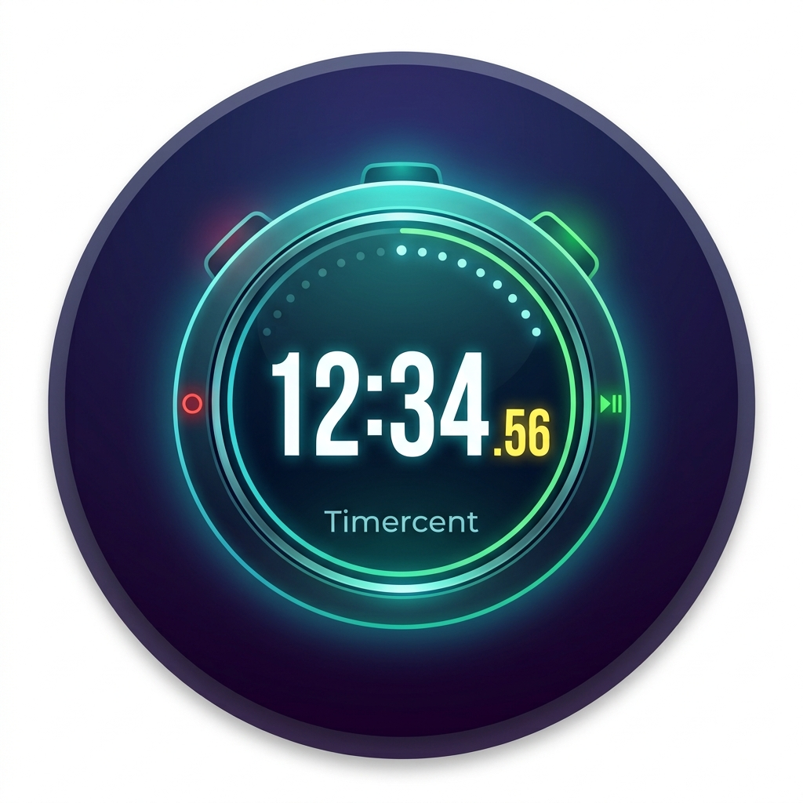
</p>

# Timercent

Timer, cronometro, orologio internazionale e sveglie per Android, con decimi e centesimi di secondo e widget completamente personalizzabili.
Senza pubblicità, senza account, senza connessione a internet.

<p align="center">
  <strong><a href="https://github.com/LucasSoftware3003/timercent/releases/latest/download/timercent-release.apk">⬇ Scarica l'APK</a></strong>
  &nbsp;·&nbsp;
  <a href="https://github.com/LucasSoftware3003/timercent/releases/latest">Ultima versione e note</a>
</p>

---

## Screenshot

### Widget

<p align="center">
  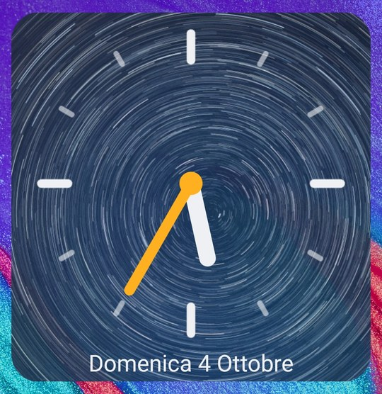
  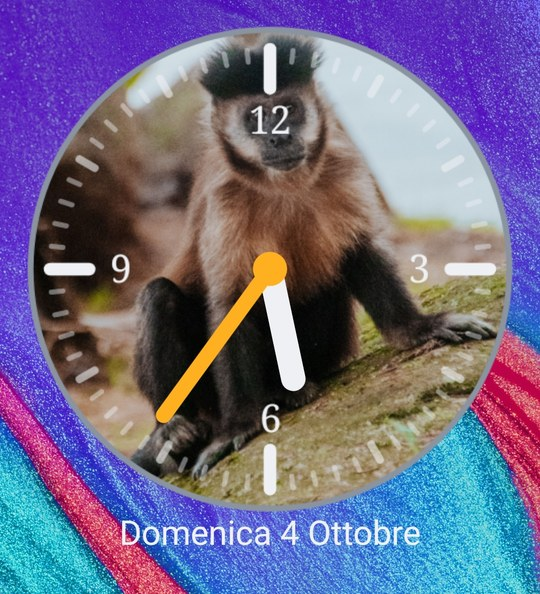
</p>
<p align="center">
  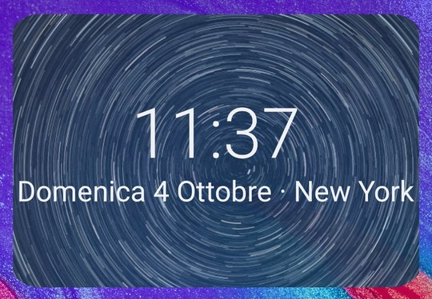
  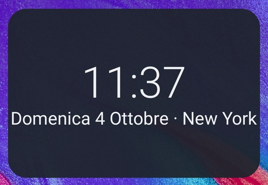
  
</p>

### App

<p align="center">
  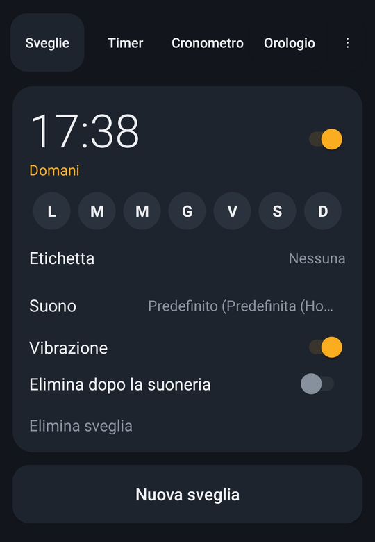
  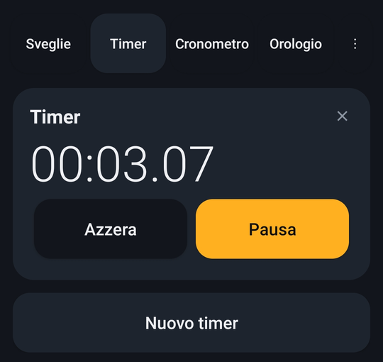
  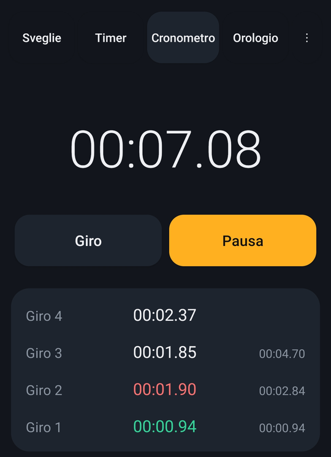
  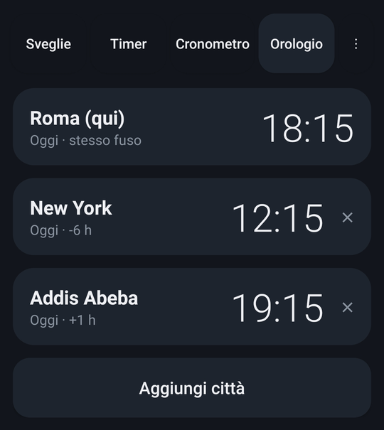
</p>

### Personalizzazione

<p align="center">
  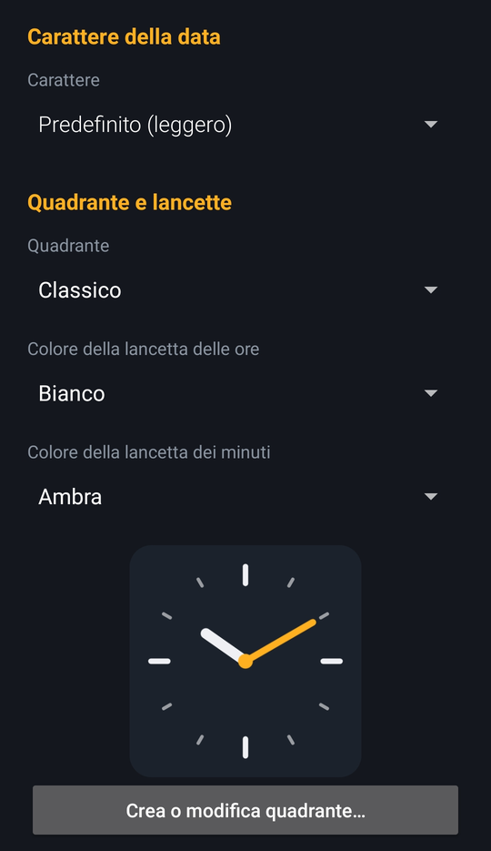
  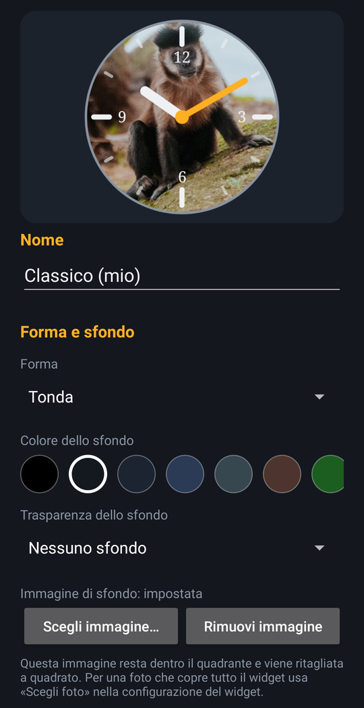
</p>

## Funzioni

### Timer e cronometro

- **Timer multipli** in parallelo, ognuno con la propria etichetta, e suono del timer a scelta.
- **Precisione a scelta**: decimi, centesimi o millesimi di secondo.
- **Cronometro** con la stessa precisione e con i **giri**: tempo di ogni giro e tempo totale, con il giro migliore in verde e il peggiore in rosso.
- Notifiche e suoneria anche con lo schermo spento.

### Interfaccia

- Tema scuro fisso, uguale su tutti i telefoni.
- Si passa da una scheda all'altra anche **scorrendo il dito** a destra e a sinistra.
- Dal menu ⋮ → *Informazioni e donazioni*: versione e build, licenza e **Cerca aggiornamenti**.

### Orologio internazionale

- Orari di città e fusi orari di tutto il mondo, in un'unica scheda.

### Sveglie

- Giorni della settimana, etichetta, suono, vibrazione e opzione «elimina dopo la suoneria».
- Posticipo, silenziamento automatico, volume crescente e comportamento dei tasti del volume.
- Inizio settimana e volume delle sveglie regolabili.
- Schermata a tutto schermo alla suoneria e ripianificazione automatica dopo il riavvio del telefono, per sveglie e timer.
- **Notifica «prossima sveglia»** con conto alla rovescia e tasto **Salta** (compare da 15 minuti a 3 ore prima, a scelta, o mai).

### Widget

Due widget, entrambi personalizzabili per ogni istanza:

- **Digitale**: 8 caratteri tra cui scegliere.
- **Analogico**: 7 quadranti predefiniti più un **costruttore di quadranti** (forma, sfondo, foto, numeri anche con font `.ttf` importato, tacche) e lancette delle ore e dei minuti con il colore scelto separatamente tra 12.
- Foto di sfondo del widget con scurimento e adattamento a scelta (*ridimensiona* oppure *centra e ritaglia*).
- Data, e città o fuso orario diverso da quello del telefono.
- **Al tocco** il widget apre la scheda che scegli: Sveglie, Timer, Cronometro o Orologio.
- Colori di testo e quadrante con selettore a palette o codice esadecimale esatto.

### Integrazione con Android

Timercent risponde alle richieste standard di sistema, quindi funziona con gli assistenti vocali e con le altre app:

| Richiesta                      | Effetto                                             |
| ------------------------------ | --------------------------------------------------- |
| `SET_ALARM` con ora           | crea la sveglia (o riusa una identica già presente) |
| `SET_TIMER` con durata        | crea il timer e lo avvia                            |
| `SHOW_ALARMS`, `SHOW_TIMERS` | aprono la scheda corrispondente                     |

Per usarlo con l'assistente, al primo comando scegli Timercent come app predefinita per sveglie e timer.

## Installazione

1. Apri la pagina [**Releases**](https://github.com/LucasSoftware3003/timercent/releases) e scarica l'ultimo file `.apk`.
2. Aprilo dal telefono e consenti l'installazione da questa fonte quando Android lo chiede.
3. Alla prima apertura concedi il permesso per le notifiche, così timer e sveglie possono avvisarti.

Requisiti: **Android 8.0 (API 26) o superiore**.

L'app non è distribuita su Google Play. Poiché si installa fuori dallo store, su alcuni dispositivi Android può mostrare avvisi o richiedere conferme aggiuntive.

Per esempio **Google Play Protect** può bloccare l'installazione, perché non ha mai visto app di questo sviluppatore. Non significa che l'app sia pericolosa: il codice è pubblico in questo repository. Per procedere tocca *Altri dettagli* e poi **Installa comunque**.

<p align="center">
  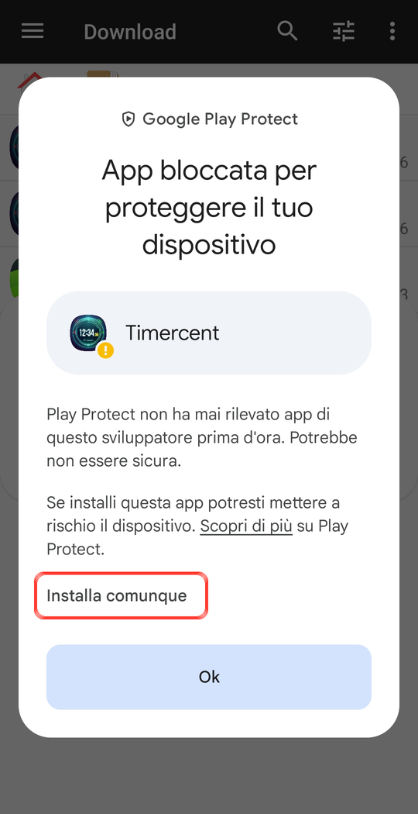
</p>

### Aggiornamenti

L'app non cerca aggiornamenti da sola, perché non ha accesso a internet. Per controllare se è uscita una nuova versione apri il menu ⋮ → *Informazioni e donazioni* → **Cerca aggiornamenti**: si apre nel browser la pagina delle Releases. Il numero di versione e di build dell'app si legge nella stessa schermata («Versione 1.23 · build N»).

## Privacy

- L'app **non richiede il permesso di accesso a internet**: non può inviare né ricevere dati.
- Timer, sveglie, impostazioni, foto e font dei quadranti restano **solo sul telefono**.
- Nessuna pubblicità, nessun tracciamento, nessun account.
- «Cerca aggiornamenti» apre solo una pagina web nel browser: la connessione la fa il browser, non l'app.

Permessi richiesti, e perché:

| Permesso                                     | Motivo                                                        |
| -------------------------------------------- | ------------------------------------------------------------- |
| Notifiche                                    | avvisi di timer e sveglie                                     |
| Sveglie e promemoria precisi                 | far suonare timer e sveglie all'ora esatta                    |
| Notifiche a tutto schermo                    | mostrare la sveglia sopra il blocco schermo                   |
| Servizio in primo piano (riproduzione audio) | suonare timer e sveglie                                       |
| Vibrazione                                   | vibrazione di timer e sveglie                                 |
| Avvio dopo il riavvio                        | riprogrammare sveglie e timer quando il telefono si riaccende |

## Compilare dal sorgente

Requisiti: JDK 17 e Gradle 8.9 (oppure Android Studio).

```
git clone https://github.com/LucasSoftware3003/timercent.git
cd timercent
gradle assembleDebug
```

L'APK di debug si trova in `app/build/outputs/apk/debug/`.

### Build automatica su GitHub Actions

A ogni push sul ramo `main` il workflow [`apk.yml`](.github/workflows/apk.yml) compila un APK **release firmato** e lo pubblica nella sezione Releases, con titolo nel formato «Timercent 1.23 (build 20)»: la versione è `versionName` in `app/build.gradle.kts`, il numero di build è il contatore delle esecuzioni del workflow. Le modifiche che toccano solo `README.md`, `LICENSE` o la cartella `docs/` non avviano la compilazione. Se fai un fork, imposta questi *secrets* nel repository per ottenere l'APK firmato:

`KEYSTORE_BASE64`, `KEYSTORE_PASSWORD`, `KEY_ALIAS`, `KEY_PASSWORD`

## Struttura del progetto

| File                                      | Contenuto                                                                   |
| ----------------------------------------- | --------------------------------------------------------------------------- |
| `MainActivity.kt`                         | schede Timer, Cronometro (con giri), Orologio, scorrimento e intent        |
| `Alarms.kt`, `AlarmsUi.kt`                | sveglie: pianificazione, suoneria, notifica «prossima sveglia», interfaccia |
| `Notif.kt`                                | canali e notifiche                                                          |
| `Widgets.kt`, `CfgBase.kt`                | widget digitale e analogico, schermate di configurazione                    |
| `Dials.kt`, `DialBuilder.kt`, `AnaRes.kt` | quadranti analogici e costruttore                                           |
| `ZonePick.kt`                             | scelta di città e fusi orari                                                |
| `About.kt`                                | schermata Informazioni e donazioni                                          |
| `docs/`                                   | screenshot usati in questo README                                           |

Package: `it.timercent`. Linguaggio: Kotlin, solo API di Android: nessuna libreria esterna.

## Sostieni lo sviluppo

Timercent è gratuita e senza pubblicità. Se ti è utile puoi offrirmi un caffè con una donazione libera e facoltativa:

[**paypal.me/LucasSoftware3003**](https://paypal.me/LucasSoftware3003)

La stessa scelta si trova nell'app, nel menu ⋮ → *Informazioni e donazioni*.

## Licenza

Timercent è software libero, rilasciato sotto licenza **GNU GPLv3**.

- Puoi usarlo, studiarlo e modificarlo liberamente.
- Se distribuisci una versione modificata (anche gratuita), devi rilasciarla sotto GPLv3 e rendere pubblico il sorgente.
- Non puoi renderlo software chiuso né venderlo senza fornire il codice.
- Nessuna garanzia: il programma è fornito «così com'è».

Testo completo: [LICENSE](LICENSE) · <https://www.gnu.org/licenses/gpl-3.0.html>

Copyright (C) 2026 Luca Serenelli (Lucas3003)

## Autore

**Luca Serenelli** aka **Lucas3003**
